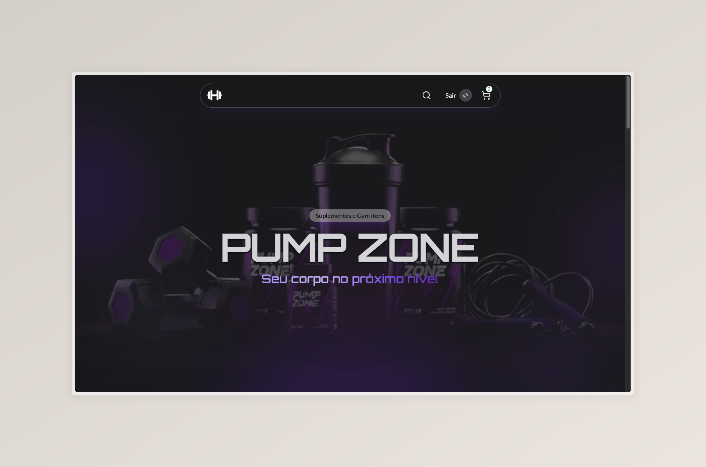

# Pump Zone — Documentação do Projeto
 

 
---
 
## Visão Geral
 
**Pump Zone** é um e-commerce de suplementos e produtos de academia desenvolvido com React, TypeScript e Firebase. O projeto cobre autenticação de usuários, listagem de produtos por categoria, carrinho de compras persistente e integração com gateway de pagamento (Stripe).
 
---
 
## Stack Tecnológica
 
| Camada | Tecnologia |
|---|---|
| Framework UI | React 19 + TypeScript |
| Build | Vite 7 |
| Estilização | Tailwind CSS v4 |
| Backend / BaaS | Firebase (Auth + Firestore) |
| Estado global | Zustand |
| Formulários | React Hook Form |
| Requisições HTTP | Axios |
| Roteamento | React Router v7 |
| Ícones | Lucide React |
 
---
 
## Estrutura de Pastas
 
```
src/
├── assets/              # Imagens, fontes e SVGs estáticos
├── components/
│   ├── cart/            # Componentes do carrinho (Cart, CartItem)
│   ├── category-details/# Detalhe de categoria
│   ├── checkout/        # Tela de checkout
│   ├── common/          # Componentes reutilizáveis (Header, Footer, Input, ProductItem...)
│   ├── explore/         # Página de exploração de produtos
│   └── home/            # Seções da home (Hero, About, Categories, Testimonials...)
├── config/              # Configuração do Firebase
├── contexts/            # Contextos React (UserContext, CartContext)
├── converters/          # Conversores Firestore (tipagem)
├── guards/              # Guards de autenticação
├── helpers/
│   └── mobile-carousel/ # Componente de carrossel responsivo
├── layout/              # Wrappers de layout (LayoutContainer, LayoutContent, LayoutHeader)
├── pages/               # Páginas da aplicação
├── stores/              # Stores Zustand (cart-store, categories-store)
└── types/               # Tipos globais (Product, Category, User, CartProduct)
```
 
---
 
## Funcionalidades Principais
 
**Autenticação**
Suporte a login com e-mail/senha e login com Google via Firebase Auth. Rotas protegidas pelo `AuthenticationGuard`, que redireciona usuários não autenticados para `/login`.
 
**Catálogo de Produtos**
Produtos organizados por categorias, armazenadas no Firestore. A home exibe seções dinâmicas — categorias em destaque, produtos em alta e depoimentos.
 
**Carrinho de Compras**
Gerenciado pelo Zustand com persistência em `localStorage`. Permite adicionar, remover, aumentar e diminuir a quantidade de itens, além de exibir o total em tempo real.
 
**Checkout e Pagamento**
Ao finalizar o pedido, a aplicação chama uma API externa (`VITE_API_URL`) vinda de um backend separado que cria uma sessão de checkout no Stripe e redireciona o usuário para a página de pagamento. O resultado é tratado em `/payment-confirmation`.
 
**Carrossel Responsivo**
O componente `MobileCarousel` adapta o layout entre carrossel de scroll horizontal no mobile e grid/flex no desktop, sem dependências externas.
 
---
 
## Páginas
 
| Rota | Componente | Descrição |
|---|---|---|
| `/` | `HomePage` | Landing page com hero, categorias, sobre e depoimentos |
| `/login` | `LoginPage` | Login com e-mail ou Google |
| `/signup` | `SignupPage` | Cadastro de novo usuário |
| `/explore` | `ExplorePage` | Overview de todas as categorias |
| `/category/:id` | `CategoryDetailsPage` | Produtos de uma categoria específica |
| `/checkout` | `CheckoutPage` | Revisão do pedido (rota protegida) |
| `/payment-confirmation` | `PaymentConfirmPage` | Confirmação ou erro de pagamento |
 
---
 
## Gerenciamento de Estado
 
O projeto utiliza **Zustand** como solução principal de estado global, substituindo o `CartContext` (que permanece no código como implementação legada).
 
**`useCartStore`** — produtos no carrinho, visibilidade do painel, operações de quantidade e limpeza pós-pagamento. O estado de produtos é persistido via middleware `persist`.
 
**`useCategoriesStore`** — lista de categorias carregadas do Firestore, com controle de loading.
 
---
 
## Configuração e Execução
 
**Pré-requisitos:** Node.js 20+
 
```bash
# Instalar dependências
npm install
 
# Iniciar em desenvolvimento
npm run dev
 
# Build de produção
npm run build
```
 
**Variáveis de ambiente necessárias** (arquivo `.env`):
 
```env
VITE_API_URL=https://sua-api.com
```
 
---
 
## Firebase
 
O projeto usa os serviços **Firestore** (banco de dados) e **Authentication**. A configuração está em `src/config/firebase.ts`. Para popular o banco com dados iniciais, execute o script:
 
```bash
node src/scripts/firebase-script.cjs
```
 
Isso insere as categorias e produtos padrão (Creatina, Whey, Hipercalórico, Pílulas e Outros) diretamente no Firestore.
 
---
 
## Qualidade de Código
 
O projeto conta com ESLint, Prettier e Husky configurados para garantir consistência. O Husky executa o lint-staged no pre-commit e valida a mensagem de commit com `git-commit-msg-linter`.
 
```bash
# Verificar lint manualmente
npm run lint
```
 
